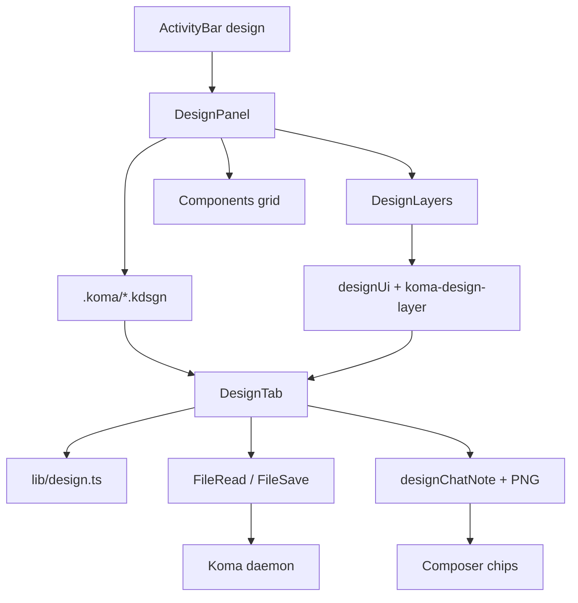
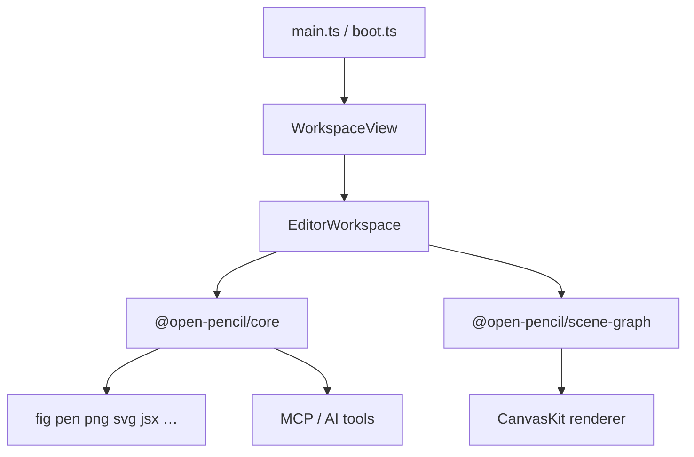

# Koma UI Designer vs OpenPencil — Parity Research

**Last updated:** 2026-09-30  
**Koma revision:** `40a32a61` on branch `feature/ui-designer`  
**OpenPencil revision:** `master` (not re-pinned this pass; feature doc dated 2026-03-07 in upstream)

**Related Koma docs:** [`ARCH_DESIGN_WEBGUI.md`](ARCH_DESIGN_WEBGUI.md) (webgui shell, IPC) · implementation in `src-webgui/src/lib/design.ts`

---

## Table of contents

1. [Executive summary](#1-executive-summary)
2. [Product positioning](#2-product-positioning)
3. [Architecture](#3-architecture)
4. [Document model & `.kdsgn` schema](#4-document-model--kdsgn-schema)
5. [Feature matrix](#5-feature-matrix)
6. [Keyboard & tools](#6-keyboard--tools)
7. [Agent & chat contract](#7-agent--chat-contract)
8. [Behavioral mismatches](#8-behavioral-mismatches)
9. [Three-way lens: Koma · OpenPencil · Figma](#9-three-way-lens-koma--openpencil--figma)
10. [Gap register (severity & effort)](#10-gap-register-severity--effort)
11. [Engineering priorities](#11-engineering-priorities)
12. [Implementation index](#12-implementation-index)
13. [Tests & documentation](#13-tests--documentation)
14. [Re-audit changelog](#14-re-audit-changelog)
15. [Quick unparity checklist](#15-quick-unparity-checklist)

**Scale (Koma designer):** `design.ts` ~3,079 LOC · `DesignTab.tsx` ~3,191 · `design.test.ts` ~1,025 · `designRender.ts` ~155

---

## 1. Executive summary

**OpenPencil** is a Figma-class standalone editor: CanvasKit rendering, `.fig`/`.pen` I/O, multi-page docs, gradients/effects/variables, export/codegen, CLI + MCP + Plugin API `eval`, WebRTC collaboration, Tauri + PWA.

**Koma UI Designer** is embedded in the Koma web GUI: React/DOM canvas, **`.kdsgn`** JSON under `<workspace>/.koma/<name>.kdsgn`, shared daemon file IPC with Coding/Diagram, and **agent-native** export via ` ```kdsgn ` fences, coordinate lists, and optional PNG attachments.

After recent GUI commits (through `40a32a61`), Koma covers a **strong flex-layout editing slice**: wrap, stretch, object snap, align/distribute, per-corner radius, text hug/metrics, per-child instance overrides, and full sidebar layers/assets.

It still does **not** match OpenPencil on file interchange, Skia fidelity, property-panel depth (gradients, effects, variable bindings), export menus, or MCP/CLI automation.

| Area | Coverage (qualitative) |
|------|-------------------------|
| Canvas editing (common flows) | ~75–80% |
| Flex auto-layout | ~70% (no CSS grid) |
| Components / instances | ~55% |
| Document I/O | ~10% (`.kdsgn` only) |
| Design systems (vs OP variables) | ~45% |
| Agent automation (Koma-native) | ~15% |
| Agent automation (OP MCP/CLI) | ~5% from Koma’s perspective |
| Live collaboration | 0% |

---

## 2. Product positioning

| Question | Prefer **Koma Design** | Prefer **OpenPencil** |
|----------|------------------------|------------------------|
| Design lives next to agent-edited code in `.koma/` | ✓ | |
| Need Figma `.fig` or design-to-code export | | ✓ |
| LLM context via fenced JSON + workspace Composer | ✓ | |
| Headless CI on designs via MCP/CLI | | ✓ |
| Multiplayer whiteboard editing | | ✓ |
| Same window as diagram, coding, git, MCP | ✓ | |
| Pixel-perfect Figma import/export | | ✓ |

Koma and OpenPencil are **complementary references**, not drop-in substitutes. Parity work should preserve Koma’s `.kdsgn` + agent loop unless product explicitly targets Figma interchange.

---

## 3. Architecture

### 3.1 Koma



| Layer | Stack | Paths |
|-------|-------|-------|
| Shell | React 19, tab kind `design` | `routes/index.tsx`, `ActivityBar.tsx`, `Sidebar.tsx` |
| Canvas | DOM nodes, SVG vectors | `components/DesignTab.tsx` |
| Model | Pure TS, immutable updates | `lib/design.ts` |
| Persistence | Zustand slice, not Monaco | `store/design.ts`, `actions/design.ts` |
| Bridge | Custom events | `designUi.ts`, `koma-design-focus`, `koma-design-commit`, `koma-design-restore` |
| Raster | Canvas2D | `lib/designRender.ts` |

**File contract** (`design.ts` header):

- Path: `<workspace>/.koma/<name>.kdsgn` — **flat** (no nested paths under `.koma/`).
- One file = tokens + components + **screens** (top-level nodes).
- Child `x/y` parent-relative; screen `x/y` are canvas coordinates.
- **Pan/zoom are not persisted** in the file.

### 3.2 OpenPencil



Reference: `packages/docs/overview/features.md`, `packages/core/src/io/formats.ts` (`BUILTIN_IO_FORMATS`: fig, pen, png, jpg, webp, svg, pdf, pptx, jsx, tailwind-jsx, html).

---

## 4. Document model & `.kdsgn` schema

### 4.1 Top-level `DesignDoc` (v1)

| Field | Type | Role |
|-------|------|------|
| `version` | `1` | Schema version |
| `modes` | `string[]` | e.g. `light`, `dark` |
| `mode` | `string` | Active mode for `resolveRef` |
| `snap` | `boolean?` | Grid snap (default omitted → off in serialize) |
| `grid` | `number?` | Grid step (default 8) |
| `tokens` | `DesignToken[]` | Design tokens |
| `components` | `DesignComponent[]` | Local components |
| `screens` | `DesignNode[]` | Top-level artboards (any `DesignKind` since loose screens) |

Parse/serialize: `parseDesign`, `serializeDesign` — invalid JSON yields `emptyDesign()` + error string.

### 4.2 `DesignNode` (selected fields)

| Field | Notes |
|-------|--------|
| `kind` | `frame \| group \| rect \| ellipse \| line \| vector \| text \| instance` |
| `layout`, `gap`, `pad`, `padTop/Right/Bottom/Left` | Flex auto-layout on frames |
| `wrap` | Multi-line flex flow |
| `align`, `justify` | incl. `stretch`, `space` |
| `wMode`, `hMode` | `hug \| fill \| fixed` |
| `minW/maxW/minH/maxH` | Size bounds |
| `absolute` | Out of auto-layout flow |
| `clip` | Frame/instance clipping |
| `fill`, `stroke`, `strokeWidth`, `opacity` | `DesignRef` or `#hex` |
| `radius` + `radiusTL/TR/BR/BL` | Corner radii (`cornerPixels`) |
| `text`, `fontSize`, `fontFamily`, `weight`, `textAlign`, `textVertical`, `textHug` | Typography |
| `color` | Text fill ref |
| `lineHeight`, `letterSpacing` | Metrics |
| `rotation`, `flipX`, `flipY` | Transform |
| `visible`, `locked` | Locked = hit target, no child walk |
| `vector` | Pen tool network |
| `component`, `variant`, `overrides[]` | Instance |
| `children` | Tree |

### 4.3 Instance overrides

```typescript
type DesignOverride = { id: string; text?: string; fill?: DesignRef; visible?: boolean }
```

- Resolved in `applyOverrides` → `resolveInstanceTree` (layout applied after override).
- UI: `mergeDesignOverride` in `DesignTab` instance props.

OpenPencil/Figma: full symbol override maps (`InstanceOverrideState`, Kiwi fields) — stroke, typography, nested props, detach semantics.

### 4.4 Node kind mapping

| Koma | OpenPencil `NodeType` |
|------|------------------------|
| 8 kinds | 17+ incl. SECTION, POLYGON, STAR, BOOLEAN_OPERATION, COMPONENT_SET, CONNECTOR, … |

Source: `design.ts` vs `open-pencil/packages/scene-graph/src/types.ts`.

---

## 5. Feature matrix

Legend: **✓** · **~** partial · **✗** · **K+** Koma-only

### 5.1 Shell & files

| Feature | Koma | OpenPencil |
|---------|------|------------|
| Embedded in agent IDE | K+ | ✗ |
| Desktop/PWA product | ✗ | ✓ |
| `.kdsgn` in `.koma/` | K+ | ✗ |
| `.fig` / `.pen` | ✗ | ✓ |
| Fingerprint save conflicts | ✓ | ~ |
| Coding history snapshots | K+ | ✗ |
| Command palette | ✗ | ~ |
| In-app Design help | ✗ | ✓ |

### 5.2 Canvas

| Feature | Koma | OpenPencil |
|---------|------|------------|
| Tools: V/F/R/O/L/P/T/H | ✓ | ✓ (+ Section, Polygon, Star) |
| Object snap + guides | ✓ | ✓ |
| Rulers | ✓ | ✓ |
| Marquee, deep select | ✓ | ✓ |
| Group hit-as-one / unwrap | ✓ | ✓ |
| Flow insert bar | ✓ | ~ |
| Boolean / vectorize | ✗ | ~ / ✓ |

### 5.3 Layout

| Feature | Koma | OpenPencil |
|---------|------|------------|
| Flex row/column | ✓ | ✓ |
| Wrap, stretch, space justify | ✓ | ✓ |
| Per-side padding, min/max | ✓ | ✓ |
| Text hug | ✓ | ✓ |
| CSS Grid | ✗ | ✓ |
| Constraints | ✗ | ✗ (OP matrix) |
| Layout guide overlays | ✗ | ✗ (OP matrix) |

### 5.4 Components & tokens

| Feature | Koma | OpenPencil |
|---------|------|------------|
| Components + variants | ✓ | ✓ |
| Per-child overrides | ~ | ✓ |
| Libraries (multi-file) | ✗ | ✓ |
| Tokens + modes | ✓ | ✓ |
| Variable bindings UI | ✗ | ✓ |

### 5.5 Paint & type

| Feature | Koma | OpenPencil |
|---------|------|------------|
| Solid + token fills | ✓ | ✓ |
| Gradients / image fills | ✗ | ✓ |
| Effects / blend | ✗ | ✓ |
| Per-corner radius | ✓ | ✓ |
| Rich text runs | ✗ | ✓ |
| Webfont pipeline | ✗ | ✓ |

### 5.6 Export / import / AI

| Feature | Koma | OpenPencil |
|---------|------|------------|
| Save native format | ✓ | ✓ |
| Export PNG/SVG/UI | ✗ | ✓ |
| JSX/Tailwind/HTML | ✗ | ✓ |
| Chat PNG + kdsgn fence | K+ | ~ |
| MCP / CLI / eval | ✗ | ✓ |

### 5.7 Collaboration

| Feature | Koma | OpenPencil |
|---------|------|------------|
| Live co-edit | ✗ | ✓ |
| Remote tab restore | ~ | ✗ |

---

## 6. Keyboard & tools

Koma shortcuts (`DesignTab.tsx` window listener). **Meta** = ⌘ on macOS, Ctrl on Linux/Windows.

| Action | Koma | OpenPencil (typical) |
|--------|------|----------------------|
| Undo / Redo | ⌘Z / ⇧⌘Z, ⌘Y | ⌘Z / ⇧⌘Z |
| Save | ⌘S | ⌘S |
| Copy / Paste | ⌘C / ⌘V | ⌘C / ⌘V |
| Duplicate | ⌘D | ⌘D |
| Copy / Paste style | ⌥⌘C / ⌥⌘V | 🔲 partial in OP matrix |
| Select all | ⌘A | ⌘A |
| Group / Ungroup | ⌘G / ⇧⌘G | ⌘G / ⇧⌘G |
| Frame selection | ⌥⌘G | — |
| Z-order | ⌘] ] ⌘[ [ | Same idea |
| Hide | ⇧⌘H | ⇧⌘H |
| Flip H/V | ⇧H / ⇧V | varies |
| Delete | Del / Backspace | Del |
| Zoom fit all / selection | ⇧1 / ⇧2 | ⌘1 / ⌘2 |
| Nudge | Arrows (⇧=10px, ⌥=duplicate) | Arrows |
| Tools | **V R O L F T P H** (no single-key Section/S) | V F S R O L T P H + flyouts |
| Pan | Space drag, H tool | Space, H |
| Escape | Exit pen/text, step out selection | varies |

Tool letters match OpenPencil for core shapes; Koma lacks **S** (Section), polygon/star keys, and OP frame preset UI.

---

## 7. Agent & chat contract

### 7.1 Query types (`DesignQuery`)

```typescript
type DesignQuery =
  | { tokens: true }
  | { component: string; variant?: Record<string, string> }
  | { screen: string }   // id or name
```

`queryDesign(doc, query)` returns a **slice** (never the full file):

- Includes `mode`, `modes`, and **only tokens referenced** by the slice tree.
- Component query: one variant tree.
- Screen query: screen tree with **instances preserved** + referenced component metadata.

### 7.2 Chat payload

| Function | Output |
|----------|--------|
| `designChatText` | ` ```kdsgn\n` + JSON slice + `\n``` ` |
| `designCoordinateText` | Indented parent-relative boxes (cap 80 lines) |
| `designChatNote` | Prose + coordinates + fence |
| `designPngBase64` | Raster via `designRender.ts` → `AttachFile` |

Composer: `designChatQueue`, chips, `splitDesignMessage` on send/recall.

### 7.3 Agent authoring guidance

- Prefer **screen** or **component** queries over dumping whole files.
- Coordinates in notes are **parent-relative**; PNG is axis-aligned render (rotation applied in raster path for nodes).
- Token names in slices are included only if referenced — agents should not invent token names not in slice.
- Round-trip editing: agent should emit valid `DesignDoc` subset inside `kdsgn` fence; GUI does not auto-apply agent JSON without user/agent tool integration (today: human paste / future tool).

### 7.4 `design.ts` public API (grouped)

**I/O:** `parseDesign`, `serializeDesign`, `emptyDesign`, path helpers  
**Tree:** `updateDesignNode`, `deleteDesignNode`, `placeDesignNode`, `moveDesignNode`, `reorderDesignNode`, `copyTree`  
**Layout:** `layoutDesign`, `autoLayoutDesign`, `measureTextBox`, `hugText` (internal)  
**Hit/drag:** `hitDesign`, `selectDesignHit`, `designDrop`, `flowBreakBar`, `designObjectSnap`, `designSnapScene`  
**Components:** `createComponentFromFrame`, `resolveInstanceTree`, `mergeDesignOverride`, `componentView`, `writeComponentView`  
**Edit ops:** `alignDesignNodes`, `nudgeDesignNodes`, `duplicateDesignNodes`, `designStyle` / `applyDesignStyle`, `wrapDesignNodes`, `unwrapDesignNode`  
**Chat:** `queryDesign`, `designChatText`, `designChatNote`, `splitDesignMessage`, `designFenceTitle`

Full export list: `rg '^export function' src-webgui/src/lib/design.ts`.

---

## 8. Behavioral mismatches

### 8.1 Screens vs pages

Koma: multiple **roots** on one canvas, shared pan/zoom. OpenPencil: **pages** with isolated viewports and move-to-page.

### 8.2 Overrides depth

Koma: `{ text, fill, visible }` per component child id. OpenPencil: Figma-compatible override graph.

### 8.3 Tokens vs variables

Koma: string refs on known fields. OpenPencil: collections, types, bindings on arbitrary properties.

### 8.4 Rendering

Koma DOM canvas may show token colors; **PNG export** resolves `#` only in `designRender.ts` — token-only colors can diverge between canvas and attachment.

### 8.5 Undo

Koma: in-tab stack, cap **50**. OpenPencil: inverse commands across operation types.

### 8.6 Workspace integration

Koma: rename/delete remaps paths via coding push handlers; design shares EditorChrome with history. OpenPencil: standalone document lifecycle.

---

## 9. Three-way lens: Koma · OpenPencil · Figma

| Capability | Koma | OpenPencil | Figma |
|------------|------|------------|-------|
| Native `.fig` | ✗ | ✓ | ✓ |
| Flex auto-layout | ✓ | ✓ | ✓ |
| Grid auto-layout | ✗ | ✓ | ✓ |
| Variables | ~ tokens | ✓ | ✓ |
| Live multiplayer | ✗ | ✓ P2P | ✓ cloud |
| Plugin API | ✗ | ~ eval | ✓ |
| Agent in IDE | K+ Composer | ~ AI tab | ✗ |

OpenPencil matrix (`figma-compatibility.md`): **94/158** items addressed (76 full, 18 partial) as of upstream doc date. Koma implements a **smaller intentional subset** aligned with agent workflows, not the full 158-item matrix.

**Shared gaps vs Figma (both Koma and OpenPencil):** constraints, layout guides, boolean ops (OP partial/none), draggable ruler guides, find/replace, full measure (Alt-hover) — see OP matrix for authoritative list.

---

## 10. Gap register (severity & effort)

| ID | Gap | Severity | Effort | Notes |
|----|-----|----------|--------|-------|
| G1 | User export PNG/SVG | P0 | M | Reuse `designRender` + DOM SVG |
| G2 | Token color on PNG = canvas | P1 | S | Resolve tokens in raster |
| G3 | Gradients / image fills | P1 | L | Schema + DOM + render |
| G4 | CSS grid layout | P2 | XL | New engine or subset |
| G5 | `.pen` import | P2 | L | Mapper to `DesignDoc` |
| G6 | Screens list panel | P2 | M | UX only — sidebar **Layers** flex + stable panel tab (2026-09-30) |
| G7 | Rich instance overrides | P2 | M | Extend `DesignOverride` + agents |
| G8 | Variable bindings | P3 | L | UI + model |
| G9 | `.fig` import | P3 | XL | Depend on fig package |
| G10 | MCP/CLI for kdsgn | P3 | L | Product choice |
| G11 | Effects / shadows | P3 | L | DOM/Skia-like CSS |
| G12 | Live collab | P4 | XL | Out of scope for Koma? |

Severity: **P0** user-visible blocker · **P1** design quality · **P2** parity · **P3** interchange · **P4** strategic

---

## 11. Engineering priorities

Assumes **keep `.kdsgn` + Composer** as source of truth.

**Tier A:** G1 export menu · G2 PNG token fix · G6 screens panel  
**Tier B:** G7 overrides for agents · G3 solid gradient v1 (linear only)  
**Tier C:** G4 grid subset · constraints  
**Tier D:** G5 pen import · G9 fig (only if required)  
**Tier E:** G10 kdsgn CLI for CI  

**Done since first parity doc:** per-corner radius · object snap · wrap/stretch · copy style · child overrides · loose screens.

**Non-goals (default):** Design-only Tauri app · full Plugin API · WebRTC whiteboard.

---

## 12. Implementation index

### Koma

| Area | Path |
|------|------|
| Editor | `src-webgui/src/components/DesignTab.tsx` |
| Sidebar | `src-webgui/src/components/panels/DesignPanel.tsx` |
| Layers | `src-webgui/src/components/DesignLayers.tsx` |
| Menu | `src-webgui/src/components/DesignMenu.tsx` |
| Model | `src-webgui/src/lib/design.ts` |
| Tests | `src-webgui/src/lib/design.test.ts` |
| Raster | `src-webgui/src/lib/designRender.ts` |
| UI bridge | `src-webgui/src/lib/designUi.ts` |
| Store | `src-webgui/src/store/design.ts`, `actions/design.ts` |
| Chat | `store/actions/session.ts`, `components/Composer.tsx` |

### OpenPencil

| Area | Path |
|------|------|
| Features | `packages/docs/overview/features.md` |
| Figma matrix | `packages/docs/reference/figma-compatibility.md` |
| Scene graph | `packages/scene-graph/src/types.ts` |
| I/O | `packages/core/src/io/formats.ts` |
| Tools | `packages/core/src/editor/tool-registry.ts` |

---

## 13. Tests & documentation

**Koma `design.test.ts`:** paths, parse/serialize, layout/wrap, components/instances/overrides, group/snap/nudge/style, pen/vector, chat fences.

**Missing:** DesignTab e2e; user-facing `docs/design.md` schema guide; README mention; Help/Tutorial tabs.

**Suggested:** Link this parity doc from `ARCH_DESIGN_WEBGUI.md` when Design ships to main.

---

## 14. Re-audit changelog

| Commit | Capability |
|--------|------------|
| `40a32a61` | Layout wrap, text hug, instance child overrides |
| `a1c68c01` | Object snap, nudge, duplicate, paste style |
| `befa8897` | Locked hits, flow insert bar, frame unparent rule |
| `41ea3785` | Group hit/unwrap, justify space |
| `4e8b887f` | `designRender.ts`, chat PNG |
| `c3692afd` | Loose screens, chat chips |
| `16f77d37` | Sidebar layers, align, type metrics |
| `8e18188e` | Groups, vectors, shapes, menu |

---

## 15. Quick unparity checklist

| Category | Still missing vs OpenPencil |
|----------|----------------------------|
| I/O | `.fig`, `.pen`, clipboard, export/import UI |
| Paint | Gradients, images, effects, blends |
| Shapes | Section, polygon, star, boolean, connector |
| Layout | CSS grid, constraints, guide overlays |
| Navigation | Pages UI |
| Systems | Libraries, variable bindings |
| Typography | Rich text, webfonts |
| Vector | Deep vertex edit |
| Product | Command palette, lint, desktop app |
| Automation | MCP/CLI/eval (OP); optional kdsgn CLI |
| Collab | Live co-edit |
| Render | CanvasKit-level fidelity |

**Koma strengths:** `.kdsgn` in workspace, daemon IPC, coding history, Composer kdsgn/PNG/coordinates, flex layout depth, object snap, component focus mode.

---

## 16. UX fixes (2026-09-30 implementation)

| Area | Change |
|------|--------|
| **Selection sync** | `design.panelTabId` + `resolveDesignPanelTab`; sidebar keeps bound design file when Chat is active; `design.fileUi` per file |
| **Sidebar** | Layers accordion `fill`; Files `max-h-28`, collapsed when switching design file |
| **Instance overrides** | `effectiveInstanceChild` / `findDesignOverride`; controlled override fields; canvas highlight via `overrideTargetId` |
| **Layout controls** | Multi-select Wrap / Clip / Absolute set all nodes consistently; fixed clears `wMode`/`hMode` |
| **Layer drag** | Reject reparent into non-container; tests for move index + absolute layout |

---

*Maintainers: refresh OpenPencil SHA and §14 when either repo makes large designer changes. Regenerate §10 if product priorities shift.*
